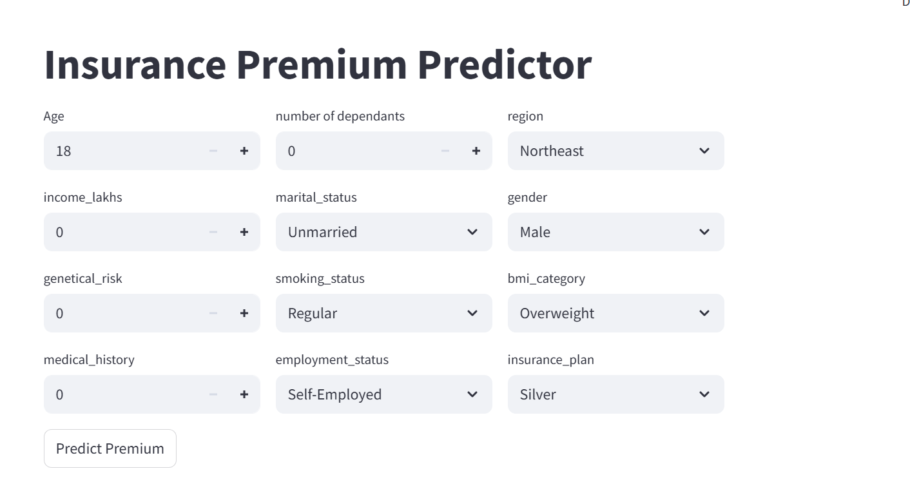
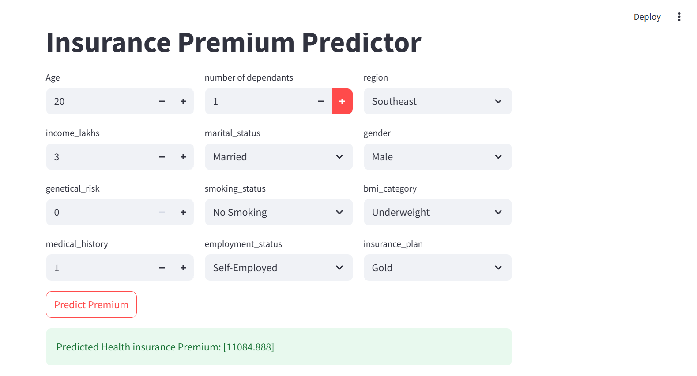

# 🏥 Health Insurance Premium Prediction using Machine Learning

## 📌 Project Overview

This project predicts the **health insurance premium cost** based on user inputs such as age, BMI, smoking habits, income, and other personal details using Machine Learning models.

It helps insurance companies estimate premium charges and assists users in understanding expected insurance costs.

---

## 🎯 Problem Statement

Calculating insurance premiums manually is complex and time-consuming. This project automates the process by building a predictive model based on historical data.

---

## 📊 Dataset Information

* **Dataset Name:** Medical Cost Personal Dataset

* **Features:**

  * Age
  * Number of Dependants
  * Region
  * Income (in lakhs)
  * Marital Status
  * Gender
  * Genetic Risk
  * Smoking Status
  * BMI Category
  * Medical History
  * Employment Status
  * Insurance Plan

* **Target Variable:** Insurance Premium Cost

---

## ⚙️ Technologies Used

* Python
* Pandas
* NumPy
* Scikit-learn
* Matplotlib / Seaborn
* Flask (for web app interface)

---

## 🔍 Project Workflow

### 1️⃣ Data Preprocessing

* Cleaned dataset
* Handled missing values
* Encoded categorical variables

### 2️⃣ Exploratory Data Analysis (EDA)

* Analyzed relationships between features and premium
* Identified key factors like smoking and BMI

### 3️⃣ Model Building

* Applied Machine Learning algorithms:

  * Linear Regression
  * Decision Tree
  * Random Forest

### 4️⃣ Model Evaluation

* Compared models using:

  * R² Score
  * Mean Absolute Error (MAE)
* Selected best-performing model

---

## 📸 Output Screenshots

### 🔹 Home Page (User Input Form)

### 🔹 Prediction Result

---

## ▶️ How to Run the Project

### Step 1: Clone the Repository

git clone https://github.com/lakshmihub-tech/health-insurance-premium-prediction-ml

### Step 2: Navigate to Project Folder

cd health-insurance-premium-prediction-ml

### Step 3: Install Dependencies

pip install -r requirements.txt

### Step 4: Run the Application

python app.py

### Step 5: Open in Browser

http://127.0.0.1:5000

---

## 📁 Project Structure

health-insurance-premium-prediction-ml/
│── app.py
│── model.py
│── requirements.txt
│── home.png
│── prediction.png
│── README.md

---

## 📈 Results

* Successfully predicted insurance premiums based on user input
* Smoking status and BMI have a significant impact on premium
* Model provides accurate and quick predictions

---

## 🚀 Future Improvements

* Deploy the application online (Render / Heroku)
* Improve accuracy using advanced models (XGBoost)
* Add user authentication system

---

## 📌 Conclusion

This project demonstrates how Machine Learning can be applied to real-world problems like insurance premium prediction, improving efficiency and decision-making.

---

## 👩‍💻 Author

**Pagadala Venkata Lakshmi**

---
